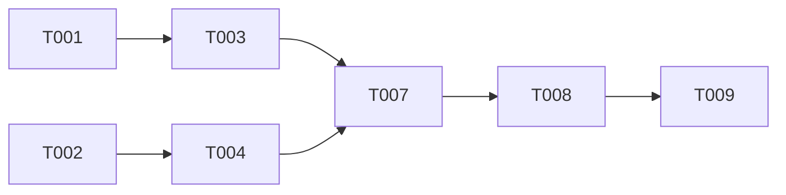

# [FEATURE_NAME] Task Breakdown

**Plan**: [PLAN_LINK]
**Created**: [DATE]

## Phase 1: Setup

- [ ] T001 [P] Create project structure per implementation plan
- [ ] T002 [P] Initialize dependencies and configuration

## Phase 2: Foundational

- [ ] T003 Implement shared utilities and base classes
- [ ] T004 Set up database schema and migrations

## Phase 3: User Story 1 - [US1_NAME]

**Goal**: [US1_GOAL]
**Acceptance**: [US1_ACCEPTANCE_CRITERIA]

### Tests (if requested)

- [ ] T005 [P] [US1] Write unit tests for [COMPONENT]
- [ ] T006 [P] [US1] Write integration tests for [FEATURE]

### Implementation

- [ ] T007 [US1] Create [MODEL] in [FILE_PATH]
- [ ] T008 [US1] Implement [SERVICE] in [FILE_PATH]
- [ ] T009 [US1] Create [ENDPOINT/UI] in [FILE_PATH]

## Phase 4: User Story 2 - [US2_NAME]

**Goal**: [US2_GOAL]
**Acceptance**: [US2_ACCEPTANCE_CRITERIA]

### Implementation

- [ ] T010 [P] [US2] Create [COMPONENT] in [FILE_PATH]
- [ ] T011 [US2] Implement [FEATURE] in [FILE_PATH]

## Final Phase: Polish

- [ ] T012 [P] Add error handling and logging
- [ ] T013 [P] Performance optimization
- [ ] T014 Documentation updates

## Dependencies

## Parallel Execution Opportunities

- Phase 1: T001, T002 can run in parallel
- Phase 3: T005, T006 can run in parallel
- Phase 4: T010 can run independently

## MVP Scope

User Story 1 only (Phase 1 + Phase 2 + Phase 3)

## Implementation Strategy

1. **MVP**: US1 only — basic functionality
2. **Incremental**: Add US2, US3 in order of priority
3. **Polish**: Final phase after all stories complete
