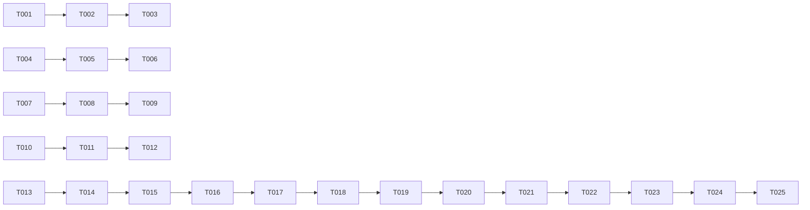

# ADB Shell Terminal 修复与增强 - 任务拆解

**Plan**: [plan.md](./plan.md)
**Created**: 2026-07-04

## Phase 1: Bug 修复

### BUG-001: 连接信息空格

- [ ] T001 检查 `src/pages/Devices.tsx` 第 114 行连接信息字符串
- [ ] T002 验证 xterm.js 渲染空格的行为
- [ ] T003 修复空格显示问题

### BUG-002: 启动 ADB 检测

- [ ] T004 在 `electron/main.cjs` 中添加 `app.whenReady()` 后发送就绪信号
- [ ] T005 在 `electron/preload.cjs` 中暴露 `onAppReady` 事件
- [ ] T006 在 `src/pages/Devices.tsx` 中等待就绪信号后再执行 `checkAndRefresh()`

### BUG-003: 中文输入

- [ ] T007 检查 `compositionend` 事件处理逻辑
- [ ] T008 修复 `composing` 标志清除时机
- [ ] T009 验证中文输入（微软拼音、搜狗输入法）

### BUG-004: 终端高度

- [ ] T010 检查终端容器 flex 布局
- [ ] T011 添加 `overflow: hidden` 到终端容器
- [ ] T012 验证窗口调整大小时终端自适应

## Phase 2: 功能实现

### FEAT-001: 命令历史导航

- [ ] T013 添加 `commandHistory` 数组到 ShellPanel（最大 300 条）
- [ ] T014 添加 `historyIndex` 跟踪当前位置
- [ ] T015 实现上方向键处理 - 显示上一条命令
- [ ] T016 实现下方向键处理 - 显示下一条命令
- [ ] T017 实现 Enter 时将命令加入历史（空命令不加入）
- [ ] T018 实现去重逻辑（连续相同命令只保留一条）
- [ ] T019 保持历史记录跨会话（切换设备不清空）

### FEAT-002: 历史命令搜索

- [ ] T020 添加 `searchMode` 和 `searchQuery` 状态
- [ ] T021 实现 Ctrl+R 进入搜索模式
- [ ] T022 实现搜索模式下的输入处理
- [ ] T023 实现搜索结果匹配和显示
- [ ] T024 实现 Enter 执行匹配命令
- [ ] T025 实现 Esc 取消搜索，恢复原命令行

## Final Phase: 验证

- [ ] T026 运行完整功能测试
- [ ] T027 验证所有 bug 已修复
- [ ] T028 验证新功能正常工作

## Dependencies

## Parallel Execution Opportunities

- Phase 1: T001, T004, T007, T010 可以并行执行
- Phase 2: T013 和 T020 可以并行执行

## MVP Scope

Phase 1 only (Bug 1-4 修复)

## Implementation Strategy

1. **MVP**: 修复 4 个 bug
2. **增强**: 实现命令历史和搜索
3. **验证**: 完整功能测试
