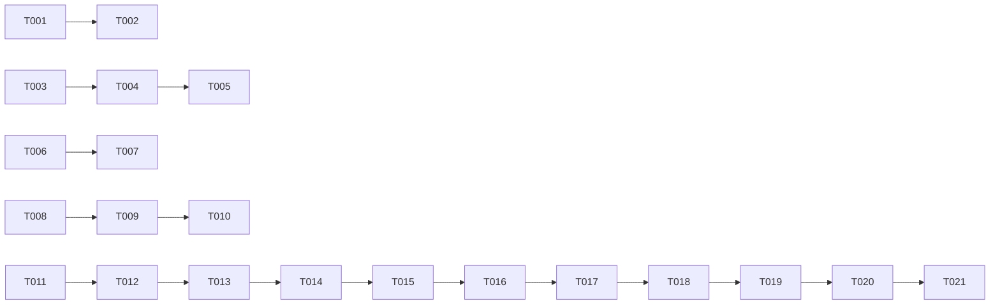

# ADB Shell Terminal 修复与增强 - 任务拆解

**Plan**: [plan.md](./plan.md)
**Created**: 2026-07-04

## Phase 1: Bug 修复

### User Story 1: 修复连接信息格式

**Goal**: 连接信息前有空格，提示符格式正确

- [ ] T001 [US1] 修复连接信息空格 - `src/pages/Devices.tsx` 第 114 行
- [ ] T002 [US1] 验证提示符格式 - 确认 ` 设备名 $ ` 格式正确

### User Story 2: 修复启动 ADB 检测

**Goal**: 程序启动后自动检测 ADB 并显示设备列表

- [ ] T003 [US2] 在 `electron/main.cjs` 中添加 `app.whenReady()` 后发送就绪信号
- [ ] T004 [US2] 在 `electron/preload.cjs` 中暴露 `onAppReady` 事件
- [ ] T005 [US2] 在 `src/pages/Devices.tsx` 中等待就绪信号后再执行 `checkAndRefresh()`

### User Story 3: 修复中文输入

**Goal**: 输入法中文字符能正确显示

- [ ] T006 [US3] 修复 `compositionend` 事件处理 - 延迟清除 `composing` 标志
- [ ] T007 [US3] 验证中文输入 - 测试微软拼音、搜狗输入法

### User Story 4: 修复终端高度

**Goal**: 窗口化模式下最后一行输入内容始终可见

- [ ] T008 [US4] 检查终端容器 flex 布局 - 确保 `flex-1 min-h-0` 正确应用
- [ ] T009 [US4] 添加 `overflow: hidden` 到终端容器
- [ ] T010 [US4] 验证窗口调整大小时终端自适应

## Phase 2: 功能增强

### User Story 5: 实现命令历史导航

**Goal**: 上下方向键能导航命令历史

- [ ] T011 [US5] 添加 `commandHistory` 数组和 `historyIndex` 到 ShellPanel
- [ ] T012 [US5] 实现上方向键处理 - 显示上一条命令
- [ ] T013 [US5] 实现下方向键处理 - 显示下一条命令
- [ ] T014 [US5] 实现 Enter 时将命令加入历史
- [ ] T015 [US5] 限制历史记录数量（最大 100 条）

### User Story 6: 实现 Ctrl+R 搜索

**Goal**: Ctrl+R 能搜索历史命令

- [ ] T016 [US6] 添加 `searchMode` 和 `searchQuery` 状态
- [ ] T017 [US6] 实现 Ctrl+R 进入搜索模式
- [ ] T018 [US6] 实现搜索模式下的输入处理
- [ ] T019 [US6] 实现搜索结果匹配和显示
- [ ] T020 [US6] 实现 Enter 执行匹配命令
- [ ] T021 [US6] 实现 Esc 取消搜索

## Final Phase: 验证

- [ ] T022 运行完整功能测试
- [ ] T023 验证所有 bug 已修复
- [ ] T024 验证新功能正常工作

## Dependencies

## Parallel Execution Opportunities

- Phase 1: T001, T003, T006, T008 可以并行执行
- Phase 2: T011 和 T016 可以并行执行

## MVP Scope

Phase 1 only (Bug 1-4 修复)

## Implementation Strategy

1. **MVP**: 修复 4 个 bug
2. **增强**: 实现命令历史和搜索
3. **验证**: 完整功能测试
