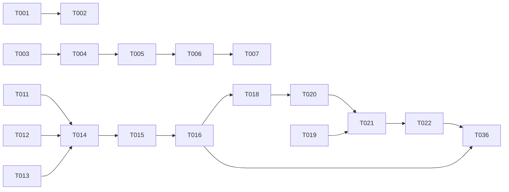

# ADB Shell Terminal 修复与增强 - 任务拆解

**Spec**: [spec.md](./spec.md)
**Plan**: [plan.md](./plan.md)
**Created**: 2026-07-04
**Updated**: 2026-07-04 - 添加日志、持久化、测试任务

## Phase 1: Bug 修复

### BUG-001: 连接信息空格

- [x] T001 [P] 截图验证连接信息空格问题 - 使用 `Ctrl+Alt+Q` 截图，检查 "adb shell connected to 设备号" 前是否有空格
- [x] T002 [BUG-001] 修复连接信息空格 - `src/pages/Devices.tsx:114` - 将空格放在 ANSI 转义码之后：`'\x1b[36m adb shell\x1b[0m...'`

### BUG-002: 启动 ADB 检测

- [x] T003 [P] [BUG-002] 创建日志目录 - `logs/` - 确保目录存在
- [x] T004 [P] [BUG-002] 添加日志工具函数 - `src/utils/logger.ts` - 实现日志写入功能，文件名格式：`YYYY-MM-DD_HH-mm-ss.log`
- [x] T005 [BUG-002] 添加 ADB 检测日志 - `src/pages/Devices.tsx:329-342` - 在 `checkAndRefresh` 函数中添加日志
- [x] T006 [BUG-002] 添加延迟重试机制 - `src/pages/Devices.tsx:344` - 修改 `useEffect` 添加 100ms 延迟
- [x] T007 [BUG-002] 更新 .gitignore - `.gitignore` - 添加 `logs/` 目录

### BUG-003: 中文输入

- [x] T008 [P] [BUG-003] 延迟清除 composing 标志 - `src/pages/Devices.tsx:109` - 修改 `compositionend` 事件处理，添加 50ms 延迟

### BUG-004: 终端高度

- [x] T009 [P] [BUG-004] 修改主内容区 overflow 属性 - `src/layouts/MainLayout.tsx:11` - `overflow-auto` → `overflow-hidden`
- [x] T010 [BUG-004] 验证终端高度自适应 - 调整窗口大小，确认最后一行输入内容可见

## Phase 2: 功能实现

### FEAT-001: 命令历史导航

- [x] T011 [P] [FEAT-001] 添加命令历史数据结构 - `src/pages/Devices.tsx` ShellPanel - 添加 `commandHistory`、`historyIndex`、`currentInput` refs
- [x] T012 [P] [FEAT-001] 实现历史加载函数 - `src/pages/Devices.tsx` ShellPanel - 从 `.adb-command-history.json` 加载历史
- [x] T013 [P] [FEAT-001] 实现历史保存函数 - `src/pages/Devices.tsx` ShellPanel - 保存历史到 `.adb-command-history.json`
- [x] T014 [FEAT-001] 修改 Enter 处理逻辑 - `src/pages/Devices.tsx` ShellPanel - 加入历史（空命令不加入，连续重复去重）
- [x] T015 [FEAT-001] 实现上方向键处理 - `src/pages/Devices.tsx` ShellPanel - 显示上一条命令
- [x] T016 [FEAT-001] 实现下方向键处理 - `src/pages/Devices.tsx` ShellPanel - 显示下一条命令
- [x] T017 [FEAT-001] 更新 .gitignore - `.gitignore` - 添加 `.adb-command-history.json`

### FEAT-002: 历史命令搜索

- [x] T018 [P] [FEAT-002] 添加搜索状态数据结构 - `src/pages/Devices.tsx` ShellPanel - 添加 `searchMode`、`searchQuery`、`searchResult` refs
- [x] T019 [P] [FEAT-002] 实现搜索辅助函数 - `src/pages/Devices.tsx` ShellPanel - `findInHistory` 和 `updateSearchDisplay`
- [x] T020 [FEAT-002] 实现 Ctrl+R 进入搜索模式 - `src/pages/Devices.tsx` ShellPanel - 显示搜索提示符
- [x] T021 [FEAT-002] 实现搜索模式输入处理 - `src/pages/Devices.tsx` ShellPanel - 字符输入、Backspace、Enter、Esc
- [x] T022 [FEAT-002] 集成搜索到 onData 处理 - `src/pages/Devices.tsx` ShellPanel - 在 `onData` 开头添加搜索模式判断

## Phase 3: 测试与验证

### 功能测试

- [ ] T023 [P] 测试 BUG-001 - 启动程序，连接设备，截图验证空格
- [ ] T024 [P] 测试 BUG-002 - 启动程序，查看 `logs/` 目录日志，验证 ADB 检测
- [ ] T025 [P] 测试 BUG-003 - 使用微软拼音输入法输入中文，验证显示正确
- [ ] T026 [P] 测试 BUG-004 - 调整窗口大小，验证终端高度自适应
- [ ] T027 [P] 测试 FEAT-001 - 执行多条命令，验证上下方向键历史导航
- [ ] T028 [P] 测试 FEAT-002 - 按 Ctrl+R，输入关键词，验证历史搜索
- [ ] T029 [P] 测试持久化 - 重启程序，验证历史记录是否保留

### 性能测试

- [ ] T030 [P] 测试 NFR-001 - 验证 ADB 检测在 2 秒内完成
- [ ] T031 [P] 测试 NFR-001 - 验证终端输入响应延迟 < 100ms

### 兼容性测试

- [ ] T032 [P] 测试 NFR-002 - 在 Windows 10 上测试所有功能
- [ ] T033 [P] 测试 NFR-002 - 在 Windows 11 上测试所有功能
- [ ] T034 [P] 测试 NFR-002 - 使用微软拼音输入法测试中文输入
- [ ] T035 [P] 测试 NFR-002 - 使用搜狗输入法测试中文输入

### 集成测试

- [ ] T036 端到端测试 - 完整流程：启动 → 检测 ADB → 连接设备 → 执行命令 → 搜索历史 → 重启验证

---

## 任务统计

| 类别 | 数量 |
|------|------|
| BUG 修复 | 10 个任务 |
| 功能实现 | 12 个任务 |
| 功能测试 | 7 个任务 |
| 性能测试 | 2 个任务 |
| 兼容性测试 | 4 个任务 |
| 集成测试 | 1 个任务 |
| **总计** | **36 个任务** |

## 并行执行机会

- Phase 1: T001, T003, T008, T009 可并行执行
- Phase 2: T011, T012, T013, T018, T019 可并行执行
- Phase 3: T023-T035 可并行执行

## 依赖关系

## MVP Scope

Phase 1 only (Bug 1-4 修复) - 约 10 个任务

## Implementation Strategy

1. **MVP**: 修复 4 个 bug (T001-T010)
2. **增强**: 实现命令历史和搜索 (T011-T022)
3. **测试**: 功能、性能、兼容性、集成测试 (T023-T036)
