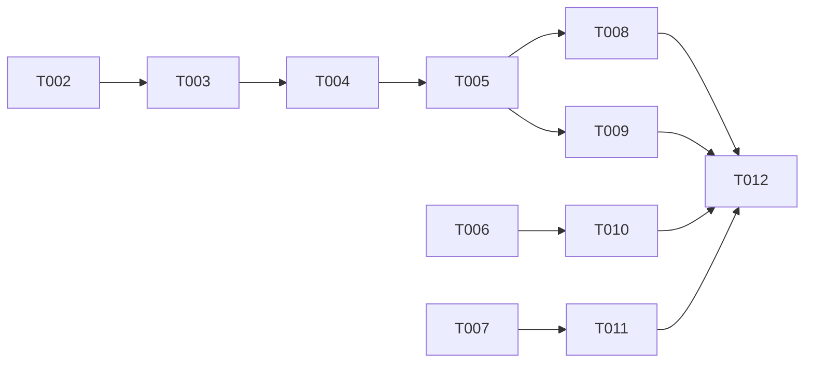

# ADB Shell Bug Fixes - 任务拆解

**Spec**: [spec.md](./spec.md)
**Plan**: [plan.md](./plan.md)
**Created**: 2026-07-07
**Status**: In Progress

## Phase 1: Bug 修复 [P]

所有 bug 修复可并行执行，无依赖关系。

### BUG-001: 输出格式化

- [x] T001 [P] [BUG-001] 修改 handleData 函数 - `src/pages/Devices.tsx` - 在 `term.write(data)` 前添加格式化：`const formatted = data.split('\n').map(line => ' ' + line).join('\n')`

### BUG-002: Ctrl+C 清空 stdin

- [x] T002 [P] [BUG-002] 添加 flush-stdin IPC handler - `electron/main.cjs` - 在 `adb:shell:kill` 后添加 `ipcMain.on('adb:shell:flush-stdin', ...)`
- [x] T003 [P] [BUG-002] 暴露 flush-stdin API - `electron/preload.cjs` - 添加 `adbShellFlushStdin: (id) => ipcRenderer.send('adb:shell:flush-stdin', id)`
- [x] T004 [P] [BUG-002] 添加类型声明 - `src/types/index.ts` - 添加 `adbShellFlushStdin: (id: string) => void`
- [x] T005 [BUG-002] 修改 Ctrl+C 处理 - `src/pages/Devices.tsx` - 调用 `window.electronAPI.adbShellFlushStdin(shellId)` 替代复制逻辑

### BUG-003: 复制功能

- [x] T006 [P] [BUG-003] 添加选中复制功能 - `src/pages/Devices.tsx` - 在 `term.open()` 后添加 `term.onSelectionChange(...)` 事件监听

### BUG-004: 最后一行可见

- [x] T007 [P] [BUG-004] 修改 writePrompt 函数 - `src/pages/Devices.tsx` - 在函数末尾添加 `term.scrollToBottom()`

## Phase 2: 测试验证

- [x] T008 [P] 测试 BUG-001 - 启动程序，连接设备，执行 `ls` 命令，验证输出每行前有空格
- [x] T009 [P] 测试 BUG-002 - 启动程序，连接设备，输入 `abc` 后 Ctrl+C，再输入 `ls`，验证执行正常
- [x] T010 [P] 测试 BUG-003 - 启动程序，连接设备，执行 `echo hello`，选中文本，在记事本粘贴验证
- [x] T011 [P] 测试 BUG-004 - 启动程序，连接设备，执行 `ls -la /system`，验证最后一行始终可见
- [x] T012 回归测试 - 验证历史命令、搜索功能、中文输入等现有功能不受影响

---

## 任务统计

| 类别 | 数量 |
|------|------|
| Bug 修复 | 7 个任务 |
| 测试验证 | 5 个任务 |
| **总计** | **12 个任务** |

## 并行执行机会

- Phase 1: T001, T002, T003, T004, T006, T007 可并行执行
- Phase 2: T008, T009, T010, T011 可并行执行

## 依赖关系

## MVP Scope

Phase 1 only (4 个 Bug 修复) - 约 7 个任务

## Implementation Strategy

1. **MVP**: 修复 4 个 bug (T001-T007)
2. **测试**: 功能测试和回归测试 (T008-T012)
