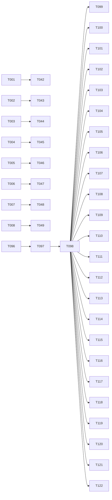

# 代码审查与质量提升 - 任务拆解

**Spec**: [spec.md](./spec.md)
**Plan**: [plan.md](./plan.md)
**Created**: 2026-07-07
**Status**: In Progress

## Phase 1: 代码审查

### Phase 1.1: 前端核心模块

- [x] T001 [P] 审查 src/App.tsx - 路由配置、ProtectedRoute、懒加载、认证检查
- [x] T002 [P] 审查 src/main.tsx - Redux Provider、HashRouter、根组件渲染
- [x] T003 审查 src/pages/Devices.tsx - ShellPanel 逻辑、ADB 命令、终端事件、中文输入、命令历史、搜索功能
- [x] T004 [P] 审查 src/pages/DevicesWeb.tsx - Socket 通信、ADB API、设备列表、错误处理
- [x] T005 [P] 审查 src/pages/Login.tsx - 飞书 OAuth、Token 存储、错误处理
- [x] T006 [P] 审查 src/pages/AuthCallback.tsx - OAuth 回调处理
- [x] T007 审查 src/components/terminal/Term.tsx - xterm.js 初始化、Addon 加载、事件监听、资源清理
- [x] T008 审查 src/components/terminal/HyperTerminal.tsx - 组件组合、Socket 事件、终端状态
- [x] T009 [P] 审查 src/components/terminal/SearchBox.tsx - 搜索功能逻辑
- [x] T010 [P] 审查 src/components/terminal/StatusBar.tsx - 状态显示逻辑
- [x] T011 [P] 审查 src/components/terminal/Header.tsx - 终端头部组件
- [x] T012 [P] 审查 src/components/Sidebar.tsx - 侧边栏导航
- [x] T013 [P] 审查 src/components/Header.tsx - 顶部栏组件
- [x] T014 [P] 审查 src/components/ErrorBoundary.tsx - 错误边界处理
- [x] T015 [P] 审查 src/components/LogViewer.tsx - 日志查看器

### Phase 1.2: 前端 Hooks

- [x] T016 [P] 审查 src/hooks/useAuth.ts - 认证状态、Token 刷新、登出处理
- [x] T017 [P] 审查 src/hooks/useSocket.ts - Socket 连接、重连逻辑、事件处理
- [x] T018 [P] 审查 src/hooks/useTerminal.ts - 终端生命周期、数据发送、状态管理
- [x] T019 [P] 审查 src/hooks/useSearch.ts - 搜索功能逻辑

### Phase 1.3: 前端工具和配置

- [x] T020 [P] 审查 src/utils/auth.ts - Token 管理、API 请求封装
- [x] T021 [P] 审查 src/utils/logger.ts - 日志工具、错误处理
- [x] T022 [P] 审查 src/store/index.ts - Redux Store 配置
- [x] T023 [P] 审查 src/store/reducers/ui.ts - UI 状态管理
- [x] T024 [P] 审查 src/store/reducers/sessions.ts - 会话状态管理
- [x] T025 [P] 审查 src/config/default.ts - 默认配置
- [x] T026 [P] 审查 src/types/index.ts - 类型定义完整性
- [x] T027 [P] 审查 src/types/hyper.ts - Hyper 风格类型定义
- [x] T028 [P] 审查 src/layouts/MainLayout.tsx - 主布局组件

### Phase 1.4: 后端模块

- [x] T029 审查 server/index.ts - Express 配置、Socket.io 集成、中间件
- [x] T030 [P] 审查 server/config.ts - 配置管理、环境变量
- [x] T031 审查 server/routes/auth.ts - OAuth 流程、Token 验证
- [x] T032 审查 server/routes/adb.ts - ADB 命令执行、设备列表
- [x] T033 [P] 审查 server/routes/logs.ts - 日志 API
- [x] T034 审查 server/services/shell.ts - Shell 进程管理、Socket 事件
- [x] T035 [P] 审查 server/types/index.ts - 类型定义

### Phase 1.5: Electron 模块

- [x] T036 审查 electron/main.cjs - 窗口创建、IPC 处理、ADB 功能
- [x] T037 [P] 审查 electron/preload.cjs - API 暴露、安全性

### Phase 1.6: 配置文件

- [x] T038 [P] 审查 package.json - 依赖版本、脚本配置
- [x] T039 [P] 审查 vite.config.ts - Vite 配置、构建优化
- [x] T040 [P] 审查 tsconfig.json - TypeScript 配置
- [x] T041 [P] 审查 .oxlintrc.json - Lint 配置

## Phase 1.7: Ponytail Review

- [ ] T042 [P] Ponytail Review src/App.tsx
- [ ] T043 [P] Ponytail Review src/main.tsx
- [ ] T044 Ponytail Review src/pages/Devices.tsx
- [ ] T045 [P] Ponytail Review src/pages/DevicesWeb.tsx
- [ ] T046 [P] Ponytail Review src/pages/Login.tsx
- [ ] T047 [P] Ponytail Review src/pages/AuthCallback.tsx
- [ ] T048 Ponytail Review src/components/terminal/Term.tsx
- [ ] T049 Ponytail Review src/components/terminal/HyperTerminal.tsx
- [ ] T050 [P] Ponytail Review src/components/terminal/SearchBox.tsx
- [ ] T051 [P] Ponytail Review src/components/terminal/StatusBar.tsx
- [ ] T052 [P] Ponytail Review src/components/terminal/Header.tsx
- [ ] T053 [P] Ponytail Review src/components/Sidebar.tsx
- [ ] T054 [P] Ponytail Review src/components/Header.tsx
- [ ] T055 [P] Ponytail Review src/components/ErrorBoundary.tsx
- [ ] T056 [P] Ponytail Review src/components/LogViewer.tsx
- [ ] T057 [P] Ponytail Review src/hooks/useAuth.ts
- [ ] T058 [P] Ponytail Review src/hooks/useSocket.ts
- [ ] T059 [P] Ponytail Review src/hooks/useTerminal.ts
- [ ] T060 [P] Ponytail Review src/hooks/useSearch.ts
- [ ] T061 [P] Ponytail Review src/utils/auth.ts
- [ ] T062 [P] Ponytail Review src/utils/logger.ts
- [ ] T063 [P] Ponytail Review src/store/index.ts
- [ ] T064 [P] Ponytail Review src/store/reducers/ui.ts
- [ ] T065 [P] Ponytail Review src/store/reducers/sessions.ts
- [ ] T066 [P] Ponytail Review src/config/default.ts
- [ ] T067 [P] Ponytail Review src/types/index.ts
- [ ] T068 [P] Ponytail Review src/types/hyper.ts
- [ ] T069 [P] Ponytail Review src/layouts/MainLayout.tsx
- [ ] T070 Ponytail Review server/index.ts
- [ ] T071 [P] Ponytail Review server/config.ts
- [ ] T072 Ponytail Review server/routes/auth.ts
- [ ] T073 Ponytail Review server/routes/adb.ts
- [ ] T074 [P] Ponytail Review server/routes/logs.ts
- [ ] T075 Ponytail Review server/services/shell.ts
- [ ] T076 [P] Ponytail Review server/types/index.ts
- [ ] T077 Ponytail Review electron/main.cjs
- [ ] T078 [P] Ponytail Review electron/preload.cjs
- [ ] T079 [P] Ponytail Review package.json
- [ ] T080 [P] Ponytail Review vite.config.ts
- [ ] T081 [P] Ponytail Review tsconfig.json
- [ ] T082 [P] Ponytail Review .oxlintrc.json

## Phase 2: 文档更新

### Phase 2.1: 项目文档

- [x] T083 更新 README.md - 项目结构、功能说明、快速开始、技术栈
- [x] T084 更新 README-WEB.md - Web 模式文档
- [x] T085 更新 AGENTS.md - 开发准则、架构速查
- [x] T086 更新 specs/ 目录下所有规范文档状态

### Phase 2.2: 开发规范

- [x] T087 创建代码风格规范文档
- [x] T088 创建 Git 工作流规范文档
- [x] T089 创建测试规范文档
- [x] T090 创建文档规范文档
- [x] T091 创建安全规范文档

### Phase 2.3: 上下文记忆文件

- [x] T092 创建 .specify/memory/constitution.md - 项目开发规范宪法
- [x] T093 创建 .specify/memory/decisions.md - 技术决策记录
- [x] T094 创建 .specify/memory/conventions.md - 代码约定
- [x] T095 创建 .specify/memory/api-docs.md - API 文档

## Phase 3: 自动化测试

### Phase 3.1: 测试配置

- [x] T096 安装测试依赖 - vitest, @testing-library/react, @testing-library/jest-dom, @testing-library/user-event, playwright
- [x] T097 创建测试配置 - vitest.config.ts, playwright.config.ts
- [x] T098 创建测试工具 - test-utils.tsx, mock-utils.ts

### Phase 3.2: 单元测试

- [x] T099 [P] 创建 src/utils/auth.test.ts - Token 管理、API 请求测试
- [x] T100 [P] 创建 src/utils/logger.test.ts - 日志工具测试
- [x] T101 [P] 创建 src/store/reducers/ui.test.ts - UI 状态管理测试
- [x] T102 [P] 创建 src/store/reducers/sessions.test.ts - 会话状态管理测试
- [ ] T103 [P] 创建 src/hooks/useAuth.test.ts - 认证 Hook 测试
- [ ] T104 [P] 创建 src/hooks/useSocket.test.ts - Socket Hook 测试
- [ ] T105 [P] 创建 src/hooks/useTerminal.test.ts - 终端 Hook 测试
- [ ] T106 [P] 创建 src/hooks/useSearch.test.ts - 搜索 Hook 测试

### Phase 3.3: 组件测试

- [x] T107 [P] 创建 src/App.test.tsx - 路由渲染测试
- [x] T108 [P] 创建 src/components/ErrorBoundary.test.tsx - 错误边界测试
- [x] T109 [P] 创建 src/components/Sidebar.test.tsx - 侧边栏测试
- [x] T110 [P] 创建 src/components/Header.test.tsx - 顶部栏测试
- [x] T111 [P] 创建 src/components/LogViewer.test.tsx - 日志查看器测试
- [ ] T112 [P] 创建 src/components/terminal/Term.test.tsx - 终端渲染测试
- [ ] T113 [P] 创建 src/components/terminal/HyperTerminal.test.tsx - 终端组件测试
- [x] T114 [P] 创建 src/components/terminal/SearchBox.test.tsx - 搜索框测试
- [x] T115 [P] 创建 src/components/terminal/StatusBar.test.tsx - 状态栏测试
- [x] T116 [P] 创建 src/components/terminal/Header.test.tsx - 终端头部测试

### Phase 3.4: 集成测试

- [ ] T117 创建 tests/integration/adb-connection.test.ts - ADB 设备连接流程
- [ ] T118 创建 tests/integration/shell-interaction.test.ts - Shell 终端交互
- [ ] T119 创建 tests/integration/auth-flow.test.ts - 飞书 OAuth 登录
- [ ] T120 创建 tests/integration/logging.test.ts - 日志记录功能

### Phase 3.5: E2E 测试

- [ ] T121 创建 tests/e2e/user-flow.spec.ts - 完整用户流程
- [ ] T122 创建 tests/e2e/error-handling.spec.ts - 错误处理流程

---

## 任务统计

| 阶段 | 任务数 | 并行任务 |
|------|--------|---------|
| Phase 1: 代码审查 | 41 | 25 |
| Phase 1.7: Ponytail Review | 41 | 30 |
| Phase 2: 文档更新 | 13 | 0 |
| Phase 3: 自动化测试 | 27 | 20 |
| **总计** | **122** | **75** |

## 依赖关系

## MVP Scope

Phase 1 + Phase 2（代码审查 + 文档更新）- 约 54 个任务

## Implementation Strategy

1. **Phase 1**: 逐文件审查，发现问题立即修复
2. **Phase 1.7**: 每个文件审查后执行 Ponytail Review
3. **Phase 2**: 更新文档和创建上下文记忆文件
4. **Phase 3**: 安装测试依赖，创建测试配置，编写测试用例
